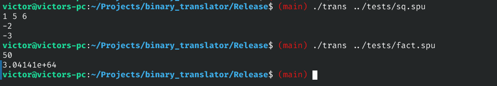

# Бинарный транслятор
Продолжение одного из моих предыдущих проектов,
в ходе которого была создана примитивная виртуальная машина со стековой архитектурой (далее -- SPU):
https://github.com/victorbaldin56/processor.
Транслирует байт-код, предназначенный для выполнения на SPU, в код для
реальных аппаратных архитектур.

## Использование
На данный момент поддерживается единственная целевая архитектура: x86-64, однако
в будущем этот список можно расширять за счет использования внутреннего промежуточного
представления (IR).

Поддерживается 2 основных режима работы:
1. Трансляция в язык ассемблера x86 диалекта [NASM](https://www.nasm.us/).
Включается опцией `-S`.
На выходе получается файл, ассемблируемый при помощи `nasm`.
Для линковки нужно вызвать линкер при помощи драйвера `clang` или `gcc`,
поскольку для поддержки ввода и вывода необходимы функции из
стандартной библиотеки C.
Пример линковки:
```sh
clang [output.o] -o [output]
```
2. JIT-трансляция (_англ._ **Just In Time**) -- транслятор генерирует нативный код для целевой архитектуры,
размещая его в буфере в динамической памяти, а затем выполняет. Данный режим
используется по умолчанию, если не указана опция `-S`.

В качестве примеров можно взять байт-код двух программ в каталоге `./tests`:
`sq.spu` (считает корни квадратного уравнения) и `fact.spu` (рекурсивно вычисляет факториал):



## Сборка и установка
Для успешной сборки и запуска требуется операционная система на базе ядра
Linux и архитектура x86-64. При других конфигурациях не проверялось,
поэтому гарантий нет.

Чтобы собрать проект из исходного кода, необходимо:
1. Клонировать этот репозиторий.
2. Создать директорию для сборки и сконфигурировать проект.
```sh
mkdir build && cd build/
cmake .. -DCMAKE_BUILD_TYPE=Release
```
3. Запустить систему сборки.

## Внутреннее устройство
Работа транслятора состоит из нескольких этапов:
1. Загрузка исходного бинарника с байт-кодом.
2. Проход по бинарнику с отображением его содержимого
в промежуточное представление (IR). IR фактически
является линейным равномерным представлением команд
виртуального процессора. Такая система была
выбрана, так как на данный момент транслятор основан на стековой
архитектуре, так же, как и SPU, а значит, является наиболее простым способом
представления программ для SPU. Разумеется, для большинства реальных
архитектур принцип стекового вычисления неэффективен, однако
на данный момент задача оптимизировать трансляцию не решена из-за
временных рамок.
3. Проход по IR и превращение его в равномерное преставление
инструкций целевой архитектуры (массив инструкций).
4. Дамп массива инструкций в виде ассемблерной программы или в
виде исполняемого буфера с нативным кодом.

## Перспективы развития
Как уже было упомянуто, одной из главных проблем моего транслятора является
сохранение стековой архитектуры. Например, сложение двух регистров виртуального процессора:
```
    push rax
    push rbx
    add
    pop rax
```
отобразится в следующий набор на x86:
```asm
    sub rsp, 0x8
    movsd [rsp], xmm2

    sub rsp, 0x8
    movsd [rsp], xmm3

    movsd xmm0, [rsp]
    add rsp, 0x8
    movsd xmm1, [rsp]
    add rsp, 0x8
    addsd xmm1, xmm0
    sub rsp, 0x8
    movsd [rsp], xmm1

    movsd xmm2, [rsp]
    add rsp, 0x8
```
В то же время это можно было выразить одной инструкцией:
```asm
addsd xmm2, xmm3
```
В будущем возможны оптимизации бэкенда, основанные на выявлении определенных
паттернов в последовательности команд и замене их на более эффективные.
На данный момент таких оптимизаций нет.

## Лицензия
WTFPL 2.0
